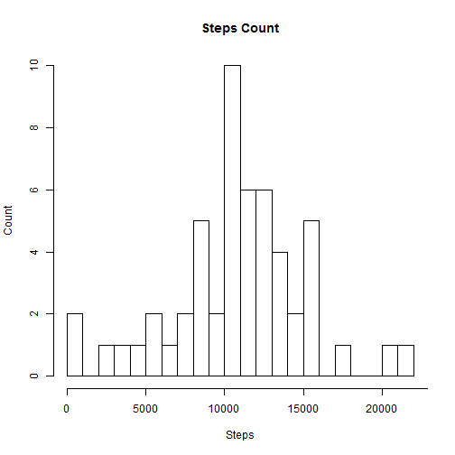
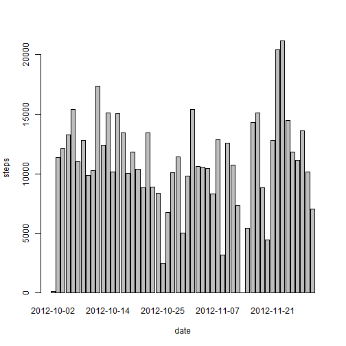
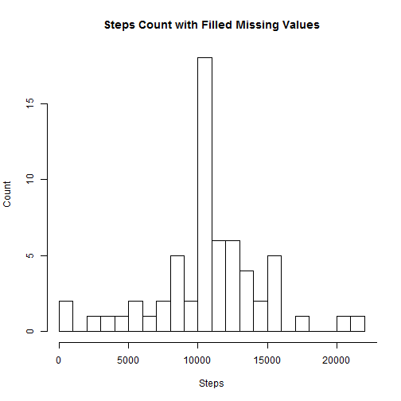
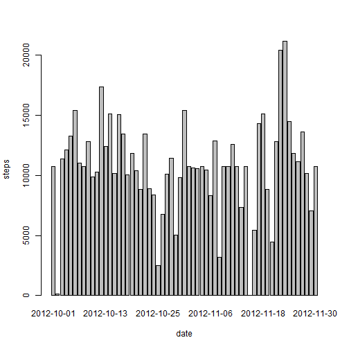
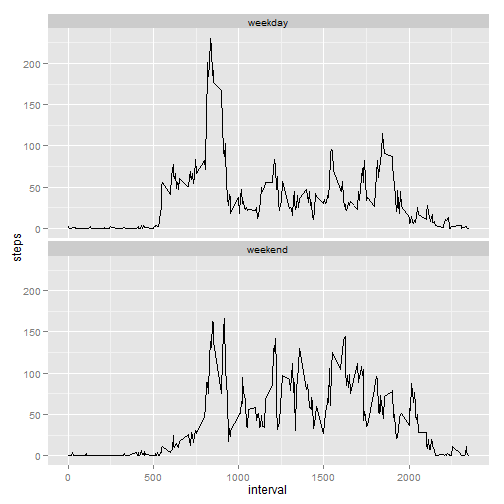

# Reproducible Reserach: Peer Assignment 1

## Loading and preprocessing the data.


```r
activity_data <- read.csv("activity.csv")
summary(activity_data)
```

```
##      steps               date          interval   
##  Min.   :  0.0   2012-10-01:  288   Min.   :   0  
##  1st Qu.:  0.0   2012-10-02:  288   1st Qu.: 589  
##  Median :  0.0   2012-10-03:  288   Median :1178  
##  Mean   : 37.4   2012-10-04:  288   Mean   :1178  
##  3rd Qu.: 12.0   2012-10-05:  288   3rd Qu.:1766  
##  Max.   :806.0   2012-10-06:  288   Max.   :2355  
##  NA's   :2304    (Other)   :15840
```

## What is mean toatal number of steps taken per day?

1. Make a hitogram of the total number of steps taken each day

```r
date_steps <- aggregate(steps~date, data=activity_data, FUN=sum, na.rm=TRUE)
hist(date_steps$steps,main="Steps Count",
     xlab="Steps",ylab="Count",breaks=30,axes=FALSE)
axis(2)
axis(1, at=seq(0,25000, by=5000), labels=seq(0,25000,by=5000))
```

 

*Make a extra barplot of the total number of steps taken each day.*

```r
barplot(date_steps$steps, names.arg=date_steps$date, xlab="date", ylab="steps")
```

 

*2012-10-01 and 2010-11-30 data was not shown in the barplot due to the missing value.*

2.Calculate and report the mean and median total number of steps taken per day

```r
mean(date_steps$steps)
```

```
## [1] 10766
```

```r
median(date_steps$steps)
```

```
## [1] 10765
```

## What is the average daily activity patter?

1.Make a time series plot of the 5-minute interval (x-axis) and the average number of steps taken, averaged across all days (y-axis)

```r
interval_steps<-aggregate(steps~interval, data=activity_data, FUN=mean)
plot(interval_steps, type="l")
```

 

2. Which 5-minute interval, on average across all the days in the dataset, contains the maximum number of steps?

```r
interval_steps$interval[which.max(interval_steps$steps)]
```

```
## [1] 835
```

## Imputing missing values
1. Calculate and report the total number of missing values in the dataset.

```r
sum(is.na(activity_data))
```

```
## [1] 2304
```

2. Devise a strategy for filling in all of the missing values in the dataset.
Strategy: Use the mean for that 5-minute interval.

3. Create a new dataset that is equal to the original dataset but with the missing data filled in.

```r
activity_fulldata<-merge(activity_data,interval_steps, by="interval",suffixes=c("",".mean"))
nrow<-nrow(activity_fulldata)
for (i in 1:nrow){
        if (is.na(activity_fulldata[i,2])==TRUE){
                activity_fulldata[i,2] <- activity_fulldata[i,4]
        }
}
```

4. Make a historam of the total number of steps taken each day and calcuate and report the mean and median total umber of steps taken per day.

```r
date_fullsteps <- aggregate(steps~date, data=activity_fulldata, FUN=sum)
hist(date_fullsteps$steps,main="Steps Count with Filled Missing Values",
     xlab="Steps",ylab="Count",breaks=30,axes=FALSE)
axis(2)
axis(1, at=seq(0,25000, by=5000), labels=seq(0,25000,by=5000))
```

 

```r
mean(date_fullsteps$steps)
```

```
## [1] 10766
```

```r
median(date_fullsteps$steps)
```

```
## [1] 10766
```

*Make a extra barplot of the total number of steps taken each day.*

```r
barplot(date_fullsteps$steps, names.arg=date_fullsteps$date, xlab ="date", ylab ="steps")
```

 

*2012-10-01 and 2010-11-30 data was shown in the barplot because the missing values were filled in.*

## Are there difference in activity patterns between weekdays and weekends?

1.Creat a new factor variable in the dataset with two levels - "weekday" and "weekend" indicating whether a given date is a weekday or weekend day.

```r
daytype <- function(date) {
    if (weekdays(as.Date(date)) %in% c("Saturday", "Sunday")) {
        "weekend"
    } else {
        "weekday"
    }
}
activity_fulldata$daytype <- as.factor(sapply(activity_fulldata$date, daytype))
```

2. Make a panel plot containing a time series plot of the 5 min interval (x-axis) and the average number of steps taken, averaged across all weekday days or weekend days(y-axis).

```r
weekday_data<-subset(activity_fulldata, activity_fulldata$daytype == "weekday")
interval_weekdaysteps<-aggregate(steps~interval, data=weekday_data, FUN=mean)
interval_weekdaysteps$daytype<-c(rep("weekday"))
weekend_data<-subset(activity_fulldata, activity_fulldata$daytype == "weekend")
interval_weekendsteps<-aggregate(steps~interval, data=weekend_data, FUN=mean)
interval_weekendsteps$daytype<-c(rep("weekend"))
interval_weeksteps<-rbind(interval_weekendsteps,interval_weekdaysteps)
library(ggplot2)
g<-ggplot(data=interval_weeksteps, aes(x=interval, y=steps))
g + geom_line() + facet_wrap(~ daytype, nrow=2)
```

 
